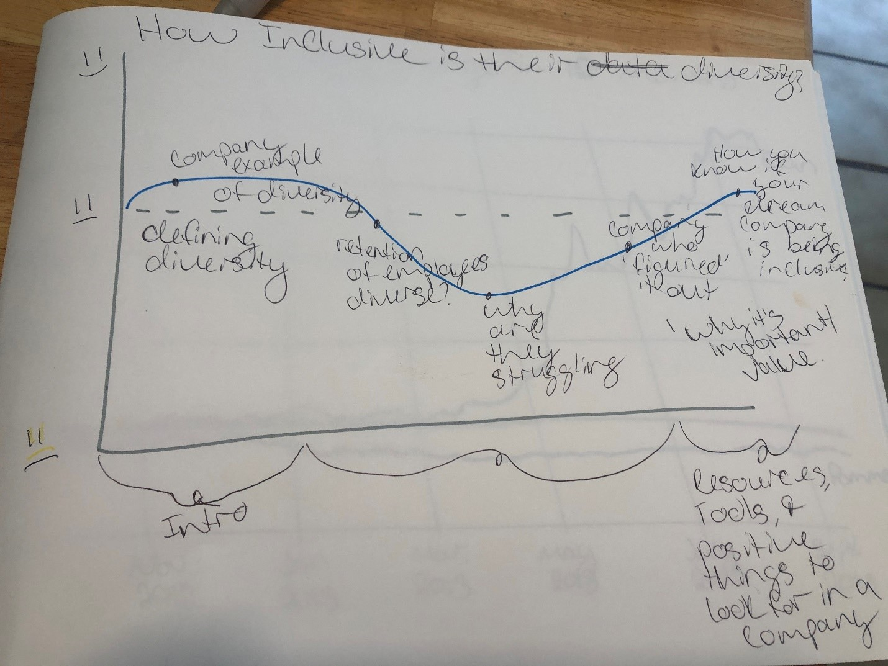

# Outline

**How Inclusive is Their Diversity?**

-	As the reader, I want to know how companies are being inclusive with their current diverse employees.  
-	I want to define Diversity & Inclusion separately.
-	Provide general data on races in the workplace based on general job functions from the census.  
-	Show how often companies seem to “fail” when it comes to diversity & inclusion.  Most companies focus or force their efforts on hiring diversity and incorporating the “Rooney rule”, but what happens to the diverse employees once they are a part of the company?
-	I would show the above by giving a company example of Berkshire Hathaway and what they provide in terms of their D&I efforts. 
-	Berkshire Hathaway says that D&I is important but does little to back that statement up with numbers and initiative. 
-	I then want to provide AT&T as an example of a company who is embracing D&I and their efforts along with the numbers that they provide for their readers and anyone learning more about their company.  
-	Lastly, I want to end with some things the reader can look for in a company for D&I and what transparency they should be looking for. 

# Method of Presenting
I plan on presenting my final project in Shorthand as I believe it will be the cleanest method to keep the data and story engaged for the reader.  In addition, I will be using Infogram to create the charts needed for my final project.

# User Research & Project Revisions
Person 1: 
After reviewing my original storyboard, the first person I got feedback from suggested using AT&T as my positive company example and that they would have a lot of data on their Diversity and Inclusion efforts. 
Person 2: 
Suggested using data on the financial aspects of D&I efforts that I company is supporting.  However, it’s even harder to find company financial statements and where they are exactly pledging that money.  
Person 3: 
This person suggested adding more general information on D&I and giving the reader initial information so they have a platform to move from when it comes to navigating this topic. 

# Wireframe
Below is the wireframe I created to showcase the journey that I wanted to take the reader on.  I originally wanted to keep it simple and focus on two companies.  This was to help the reader think of each as a good/bad guy in the story of diversity and inclusion.  However, I want to add more to it and start with definitions of D&I and why they are important based off census data. 

# Data Sources
https://www.forbes.com/sites/patsydoerr/2018/11/05/four-companies-who-are-getting-diversity-inclusion-right-and-how-theyre-doing-it/#ac93f5d57a2b
https://www.refinitiv.com/content/dam/marketing/en_us/documents/reports/diversity-and-inclusion-top-100-companies.pdf
https://www.forbes.com/sites/niharchhaya/2020/06/29/why-diversity-and-inclusion-efforts-fail-to-deliver-and-how-to-change-that/#5f393ebf57be
https://data.bls.gov/cgi-bin/dbdown?REQUEST_ERROR_MESSAGE
https://www.cnbc.com/2020/06/11/companies-are-making-bold-promises-about-greater-diversity-theres-a-long-way-to-go.html
https://builtin.com/diversity-inclusion/diversity-in-the-workplace-statistics
https://www.comparably.com/companies/berkshire-hathaway/diversity
https://www.huffpost.com/entry/berkshire-hathaway-diversity_n_3222455
https://diversityjournal.com/19148-why-diversity-equity-and-inclusion-struggle-in-corporate-america/
https://hbr.org/2017/08/what-11-ceos-have-learned-about-championing-diversity
https://drduru.com/onetwentytwo/2016/05/01/warren-buffett-is-tone-deaf-on-diversity/
https://assets2.hrc.org/files/assets/resources/CEI-2020.pdf?_ga=2.154170296.1253643112.1595892998-1436776610.1595892998
https://www.washingtonblade.com/2019/11/30/just-how-diverse-are-national-residential-real-estate-firms/
https://about.att.com/pages/diversity
https://about.att.com/pages/diversity/our_employees
https://www.fool.com/investing/general/2013/05/12/the-3-worst-large-cap-companies-for-workplace-dive.aspx
https://www.forbes.com/sites/laurarittenhouse/2019/05/08/how-warren-buffett-made-history-last-friday-and-why-this-matters/#6f894a8891ef
https://www.bhhs.com/about
https://investors.att.com/corporate-governance/leadership
https://drduru.com/onetwentytwo/2020/05/03/warren-buffett-welcomes-more-discussion-on-diversity/
https://omaha.com/money/low-ranked-berkshire-adds-to-its-diversity/article_3e06ee5a-1bc3-51ad-b4d8-5335d1609459.html
https://hbr.org/2020/05/diversity-and-inclusion-efforts-that-really-work
https://www.mercer.com/content/dam/mercer/attachments/private/gl-2020-wwt-global-research-report-2020.pdf

